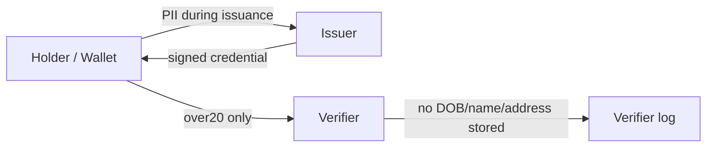

# BLOG_NOTES

## 中心メッセージ

情報漏洩を完全に防げないなら、そもそも不要な個人情報を持たなければいい。

## 想定タイトル案

- 年齢確認で生年月日を渡さないPoCを作った
- 「20歳以上か」だけを確認するために、氏名や住所まで預かる必要はあるのか
- 守り切れないなら持たない: verifier側PII最小化の小さな実験

## 記事構成

### 1. 最近、個人情報漏洩が多すぎる

- 漏洩対策は必要だが、完全には防げない。
- 防御を強くするだけでなく、漏れて困るデータを最初から持たない設計も考えたい。
- 年齢確認はその題材として分かりやすい。

### 2. 年齢確認で本当に必要な情報は何か

- サービスが知りたいのは多くの場合「条件を満たすか」。
- 例: 酒類販売なら「20歳以上か」。
- 氏名、住所、正確な生年月日、本人確認書類そのものは、verifierにとって過剰なことがある。

### 3. 生年月日ではなく「20歳以上か」だけでいいのでは

- issuerが本人確認し、`over20: true`のような属性に署名する。
- holderはcredentialをローカルに保持する。
- verifierには必要な属性だけを選択開示する。

### 4. PoCを作ってみた

- 小さな実験プロジェクトとしてAIを使いながら実装した。
- 目的は本番基盤ではなく、データ最小化の発想を動くコードで確認すること。
- SD-JWT風の選択開示、holder key binding、nonce、audience、失効を入れた。

### 5. verifierに実際に送られるデータ

- shop verifierへ送るのは`over20`のdisclosureとpresentation。
- verifierのログには`over20: true`だけが残る。
- 従来方式の比較では、氏名、住所、生年月日、電話番号がそのままログに残る。
- ただしissuerには発行時にPIIを送っている。ここを混同しない。

### 6. 防げること

- verifierのDBやログが漏洩した場合のPII被害を減らせる。
- verifierが正確な生年月日や住所を保存しなくてよくなる。
- presentationの単純なリプレイはnonceで防げる。
- credential単体のコピー利用はholder key bindingで難しくなる。

### 7. 防げないこと

- 完全な匿名性。
- cross-site unlinkability。
- issuerとverifierが結託した場合の識別。
- issuer署名鍵が漏れた場合の偽credential発行。
- credentialの貸し借り。
- 本物のeKYCや運用上の本人確認問題。

### 8. issuerを誰にするのかという問題

- 技術だけでは決まらない。
- 行政、通信キャリア、銀行、認定事業者など候補はある。
- issuerがPIIを扱う以上、issuer側のデータ保持方針と監査が重要。
- 「issuerは属性を正しく証明する」と「issuerがPIIを安全に保持する」は別の信頼。

### 9. 「守る」より「持たない」

- セキュリティは守る技術だけではない。
- 収集するデータを減らすこと自体が強い設計判断。
- verifierが必要以上の個人情報を持たないだけで、漏洩時の被害範囲は変わる。

## 注意して書くこと

- このPoCはゼロ知識証明ではない。
- 完全匿名ではない。
- verifier間でリンク不能ではない。
- 本番投入できる認証基盤ではない。
- issuerは発行時にPIIを見る。
- 「PIIが一切ネットワークを流れない」とは書かない。

## 入れたい図

