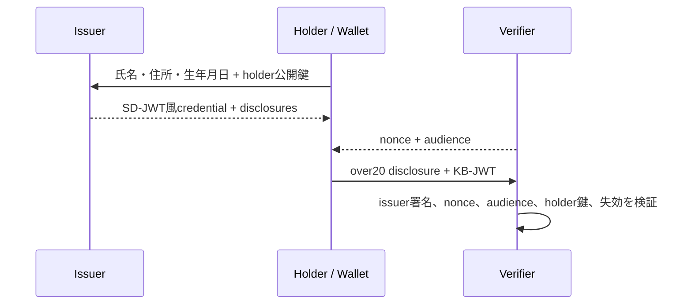

# zero-pii-age-verify

なぜWebサイトに生年月日を送る必要があるのでしょうか。サイトが知りたいのが「20歳以上かどうか」だけなら、氏名、住所、正確な生年月日、本人確認書類そのものを受け取らなくてもよいはずです。

このリポジトリは、その考え方を試すための小さなプライバシー/セキュリティPoCです。目的は本番用の身元確認基盤を作ることではなく、verifier側のデータ最小化をコードで説明できる形にすることです。

中心になる主張は次の通りです。

> verifierは、ユーザーの正確な生年月日、氏名、住所、本人確認書類を受け取らずに、年齢しきい値を満たすことだけを確認できる。

## 問題

多くの年齢確認では、サービスが本当に必要としている情報よりも多くの個人情報を集めてしまいます。データ漏洩を完全に防ぐことはできないので、そもそも不要な個人情報を持たない設計には価値があります。

このPoCでは、issuerは発行時にモックの本人確認情報を受け取ります。一方で、shopのようなverifierは、発行済みcredentialから選択開示された`over20`だけを受け取ります。

## アーキテクチャ



- `src/lib/sdjwt.ts`: 依存なしの簡易SD-JWT風エンジン
- `src/server/index.ts`: issuer API、verifier API、失効API、デモ用ログ
- `src/client/wallet.ts`: holder鍵とcredentialをIndexedDBに保存するウォレット
- `src/client/shop.ts`: `over20`だけを要求するデモshop

## Verifierが学ぶこと

通常のデモフローでshop verifierが受け取るのは次だけです。

- `over20: true`
- credential ID (`vcId`)
- holder公開鍵を含むissuer署名済みcredential
- nonce/audience/sd_hashを含むkey binding JWT

## Verifierが学ばないこと

shop verifierには、次の値を開示しません。

- 氏名
- 住所
- 正確な生年月日
- 本人確認書類

ただし、issuerは発行時にモック本人確認情報として氏名、住所、生年月日を受け取ります。このPoCは「PIIが一切ネットワークを流れない」ものではありません。

## デモの流れ

1. `/wallet.html`でパスキー登録またはログインを行う。
2. モック本人確認フォームを入力し、credentialを発行する。
3. walletはcredential、disclosures、holder鍵をローカルIndexedDBに保存する。
4. `/shop.html`で購入ボタンを押す。
5. walletは`over20`だけを開示し、nonceとaudienceに束縛したpresentationを送る。
6. shop verifierは署名、holder鍵束縛、nonce、audience、期限、失効状態を検証する。
7. 従来方式ボタンを押すと、PIIを直接送る場合とのログ差分を確認できる。

## 実装済みの性質

- issuer signature verification
- holder key binding
- nonce / replay protection
- audience binding
- credential expiration
- revocation status check
- verifier側の選択開示

## 制限

このPoCは、次の問題を解決しません。

- 本番レベルの本人確認
- 完全な匿名性
- verifier間のunlinkability
- ZKPベースの証明
- trustlessな年齢確認
- issuerとverifierが結託した場合のプライバシー
- issuer署名鍵が漏洩した場合の完全な保護
- credentialの貸し借りや端末ごとの実利用者確認

特に、この実装では同じcredential IDとholder公開鍵を含むSD-JWTを複数のverifierに提示し得るため、verifier同士が照合すればpresentationをリンクできます。

## 実行

```bash
npm install
npm run build
npm run dev
```

デモURL:

- wallet: `http://localhost:8787/wallet.html`
- shop: `http://localhost:8787/shop.html`

devモードでは管理者デモ用の失効トークンとして`dev-admin-token`を使えます。本番風に動かす場合は`ZEROPII_ADMIN_TOKEN`を設定してください。

## テスト

```bash
npm run smoke
npm run e2e
npm run typecheck
```

## 参考

- IETF SD-JWT draft
- OpenID4VP / EUDI Wallet

このリポジトリの実装は学習用に簡略化した独自サブセットです。標準準拠や本番投入を意図したものではありません。
