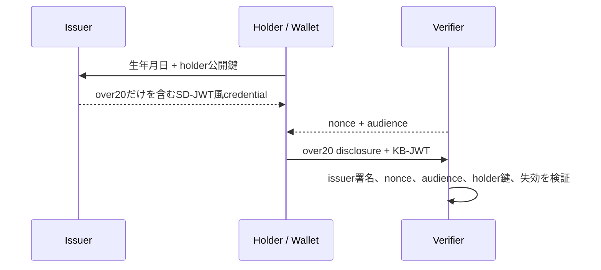

# zero-pii-age-verify

なぜWebサイトに生年月日を送る必要があるのでしょうか。サイトが知りたいのが「20歳以上かどうか」だけなら、氏名、住所、正確な生年月日、本人確認書類そのものを受け取らなくてもよいはずです。

このリポジトリは、その考え方を試すための小さなプライバシー/セキュリティPoCです。目的は本番用の身元確認基盤を作ることではなく、年齢確認に必要な情報だけを残す設計をコードで説明できる形にすることです。

中心になる主張は次の通りです。

> verifierは、ユーザーの正確な生年月日、氏名、住所、本人確認書類を受け取らずに、年齢しきい値を満たすことだけを確認できる。

## 問題

多くの年齢確認では、サービスが本当に必要としている情報よりも多くの個人情報を集めてしまいます。データ漏洩を完全に防ぐことはできないので、そもそも不要な個人情報を持たない設計には価値があります。

このPoCでは、issuerは発行時にモック入力として生年月日を受け取り、`over20`を計算します。その後、発行されるcredentialにもwalletにも正確な生年月日は保存しません。shopのようなverifierは、credentialから開示された`over20`だけを受け取ります。

## アーキテクチャ



- `src/lib/sdjwt.ts`: 依存なしの簡易SD-JWT風エンジン
- `src/server/age.ts`: カレンダー日付検証と年齢しきい値判定
- `src/server/index.ts`: issuer API、verifier API、失効API、デモ用ログ
- `src/client/wallet.ts`: holder鍵と最小credentialをIndexedDBに保存するウォレット
- `src/client/shop.ts`: `over20`だけを要求するデモshop

## Credentialに入るもの

発行されるcredentialのdisclosure claimは次だけです。

- `over20: true`または`over20: false`

issuer署名済みpayloadには、プロトコル上必要なメタデータも含まれます。

- issuer
- issued-at / expiration
- credential ID
- revocation status index
- holder public key
- salted disclosure hash

## Verifierが学ぶこと

通常のデモフローでshop verifierが受け取るのは次です。

- `over20`
- credential ID
- holder公開鍵を含むissuer署名済みcredential
- nonce/audience/sd_hashを含むkey binding JWT

## Verifierが学ばないこと

shop verifierには、次の値を開示しません。

- 氏名
- 住所
- 正確な生年月日
- 本人確認書類

このPoCは、issuerが発行時に生年月日を一時的に見ることを許容します。ただし、issuerは`over20`を計算した後、raw PIIをcredential、wallet、公開ログに残さない設計にしています。

## デモの流れ

1. `/wallet.html`でパスキー登録またはログインを行う。
2. モック生年月日を入力し、credentialを発行する。
3. walletは`over20` credential、disclosure、holder鍵をローカルIndexedDBに保存する。
4. `/shop.html`で購入ボタンを押す。
5. walletは`over20`だけを開示し、nonceとaudienceに束縛したpresentationを送る。
6. shop verifierは署名、holder鍵束縛、nonce、audience、期限、失効状態を検証する。
7. 従来方式ボタンを押すと、PIIを直接送る場合とのログ差分を確認できる。

## 実装済みの性質

- issuer signature verification
- explicit JOSE header allowlist
- holder key binding
- nonce / replay protection
- audience binding
- credential expiration
- revocation status check
- verifier側のデータ最小化

## 制限

データ最小化は匿名性やunlinkabilityとは別物です。このPoCは、次の問題を解決しません。

- 本番レベルの本人確認
- 完全な匿名性
- verifier間のunlinkability
- ZKPベースの証明
- trustlessな年齢確認
- issuerとverifierが結託した場合のプライバシー
- issuer署名鍵が漏洩した場合の完全な保護
- credentialの貸し借りや端末ごとの実利用者確認

特に、この実装では同じcredential IDとholder公開鍵を含むSD-JWTを複数のverifierに提示し得るため、verifier同士が照合すればpresentationをリンクできます。

## 実行

```bash
npm install
npm run build
npm run dev
```

デモURL:

- wallet: `http://localhost:8787/wallet.html`
- shop: `http://localhost:8787/shop.html`

devモードでは管理者デモ用の失効トークンとして`dev-admin-token`を使えます。本番風に動かす場合は`ZEROPII_ADMIN_TOKEN`を設定してください。

## テスト

```bash
npm run smoke
npm run e2e
npm run typecheck
```

## 参考

- IETF SD-JWT draft
- OpenID4VP / EUDI Wallet

このリポジトリの実装は学習用に簡略化した独自サブセットです。標準準拠や本番投入を意図したものではありません。
